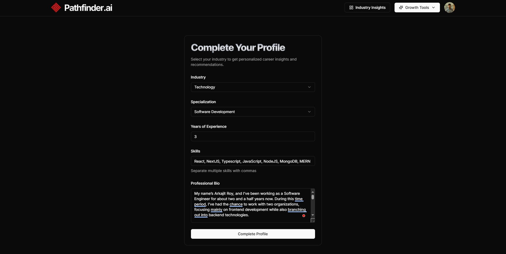

# 🧠 Pathfinder-AI: Your AI-Powered Job Insight Assistant


Welcome to **Pathfinder-AI**, an innovative AI-driven SaaS platform designed to empower job seekers with intelligent insights and personalized guidance. Navigate the job market confidently, whether you're exploring career paths, refining applications, or seeking tailored advice.

## 🌟 Features

- **Secure Authentication**: Sign in seamlessly using Clerk with Google, email, or password-based authentication.
- **Market Trends Analyzer**: AI-driven analysis of job market trends with personalized suggestions.
- **AI-Powered Insights**: Leverage Gemini AI for intelligent job recommendations and career guidance.
- **Job-Ready Tools**: Build professional resumes and cover letters with AI-powered tools.
- **AI Mock Interview**: Practice with realistic, AI-generated interview questions and feedback.
- **Modern Tech Stack**: Built with Next.js 15 for a fast, scalable, and SEO-friendly experience.
- **Beautiful UI**: Styled with Tailwind CSS and Shadcn UI for a sleek, user-friendly interface.
- **Robust Backend**: Seamless integration with Convex for reliable performance and scalability.

## 🚀 Getting Started

Follow these steps to set up Pathfinder-AI locally, explore a live demo, or deploy it to production.

### Prerequisites

- **Node.js**: Version 18.x or higher
- **npm or Yarn**: For package management
- **Clerk Account**: For authentication setup
- **Convex Account**: For database configuration
- **Gemini AI API Key**: For AI-powered features
- **Git**: To clone the repository

### Installation

1. **Clone the Repository**:

   ```bash
   git clone https://github.com/your-repo/pathfinder-ai.git

   cd pathfinder-ai
   ```

2. **Install Dependencies**:

   ```bash
   npm install
   ```

   or

   ```bash
   yarn install
   ```

3. **Set Up Environment Variables**:
   Create a `.env.local` file in the root directory and add the following:

   ```bash
   NEXT_PUBLIC_CLERK_PUBLISHABLE_KEY=your_clerk_publishable_key
   CLERK_SECRET_KEY=your_clerk_secret_key
   NEXT_PUBLIC_CLERK_SIGN_IN_URL=/sign-in
   NEXT_PUBLIC_CLERK_SIGN_UP_URL=/sign-up
   NEXT_PUBLIC_CLERK_AFTER_SIGN_IN_URL=/onboarding
   NEXT_PUBLIC_CLERK_AFTER_SIGN_UP_URL=/onboarding
   DATABASE_URL=your_convex_database_url
   GEMINI_API_KEY=your_gemini_api_key
   ```

4. **Run the Development Server**:
   ```bash
   npm run dev
   ```
   or
   ```bash
   yarn dev
   ```
   or
   ```bash
   pnpm run dev
   ```

## 📸 Screenshots

Here’s a glimpse of Pathfinder-AI in action:

### Onboarding Form

Initial setup form to personalize your Pathfinder-AI dashboard experience.



### Industry Insights

AI-driven analysis of job market trends with actionable insights.


### AI Resume Builder

Create professional resumes with AI assistance, featuring customizable templates.

<div style="display: flex; gap: 20px;">
  
  
</div>

### AI Cover Letter Builder

Generate tailored cover letters with AI-driven suggestions and previews.

<div style="display: flex; gap: 20px;">
  
  
</div>

### AI Mock Interview

Practice with AI-generated interview questions and receive real-time feedback.

<div style="display: flex; gap: 20px;">
  
  
</div>

## 🛠️ Tech Stack

- **Frontend**: Next.js 15, React, Tailwind CSS, Shadcn UI
- **Authentication**: Clerk
- **AI Integration**: Gemini AI
- **Others**: TypeScript, ESLint, Prettier

Thank you for exploring Pathfinder-AI! We’re excited to help you navigate the job market with confidence. Happy building! 💻✨
